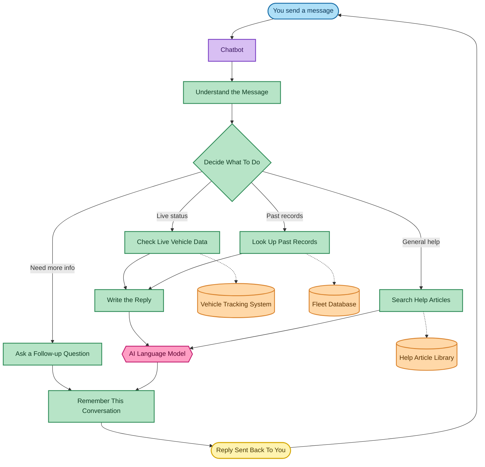

```mermaid
flowchart TD
    You([You send a message]):::client
    Chatbot[Chatbot]:::api
    Understand[Understand the Message]:::agent
    Decide{Decide What To Do}:::agent
    Ask[Ask a Follow-up Question]:::agent
    Live[Check Live Vehicle Data]:::agent
    Records[Look Up Past Records]:::agent
    Search[Search Help Articles]:::agent
    Write[Write the Reply]:::agent
    Remember[Remember This Conversation]:::agent
    Reply([Reply Sent Back To You]):::output

    AI{{AI Language Model}}:::ai

    VehicleSys[(Vehicle Tracking System)]:::datasource
    FleetDB[(Fleet Database)]:::datasource
    HelpLib[(Help Article Library)]:::datasource

    You --> Chatbot --> Understand --> Decide

    Decide -->|Need more info| Ask
    Decide -->|Live status| Live
    Decide -->|Past records| Records
    Decide -->|General help| Search

    Live -.-> VehicleSys
    Records -.-> FleetDB
    Search -.-> HelpLib

    Live --> Write
    Records --> Write
    Write --> AI
    Search --> AI

    Ask --> Remember
    AI --> Remember
    Remember --> Reply --> You

    classDef client fill:#AEDFF7,stroke:#1B6FA8,stroke-width:2px,color:#0B3556
    classDef api fill:#D8BFF3,stroke:#7A3FC4,stroke-width:2px,color:#3A1660
    classDef agent fill:#B7E4C7,stroke:#2E8B57,stroke-width:2px,color:#0E3B22
    classDef datasource fill:#FFD8A8,stroke:#D9822B,stroke-width:2px,color:#5C3200
    classDef ai fill:#FF9EC4,stroke:#C21E70,stroke-width:2px,color:#5C0030
    classDef output fill:#FFF3B0,stroke:#D4A600,stroke-width:2px,color:#4A3A00
```
