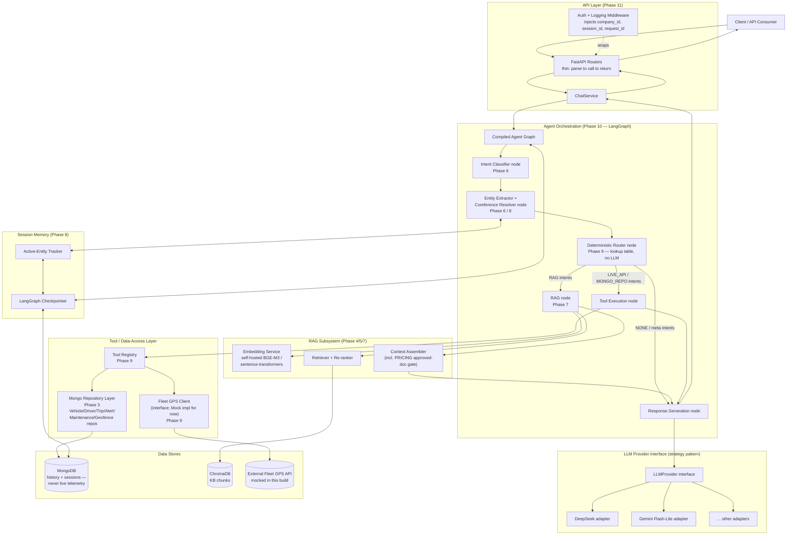

# Component Diagram — Phase 2

## Diagram

## Component responsibilities

| Component | Owning phase | Responsibility | Must NOT do |
|---|---|---|---|
| FastAPI Routers | 11 | Parse HTTP request → call `ChatService` → serialize response | Contain business logic, call repositories/LLM directly |
| Auth + Logging Middleware | 11 | Resolve `company_id` from auth, generate/propagate `request_id`, attach `session_id` | Be bypassable — every route passes through it |
| ChatService | 11 | One turn's orchestration: load/save session, invoke agent graph, map to response DTO | Contain intent/routing logic (that's the graph's job) |
| Agent Graph (LangGraph) | 10 | Sequence the nodes below per turn; own the state schema | Import FastAPI types |
| Intent Classifier node | 6 | Map utterance (+ session state) → one intent from the Phase 1 taxonomy | Decide which tool/subsystem to call |
| Entity Extractor / Coreference node | 6, 8 | Extract raw entity spans, normalize (e.g. `vehicle_ref` canonicalization), resolve pronouns via active-entity tracker | Resolve to Mongo IDs itself without a repository lookup |
| Deterministic Router node | 9 | Pure lookup: intent → {subsystem, tool/handler, required entities, gate fn} | Call an LLM to decide routing |
| Tool Execution node | 9/10 | Invoke the resolved tool via the Tool Registry, handle missing-entity/backlog-intent rejection | Talk to Mongo/Fleet API directly (must go through registry → repo/client) |
| Tool Registry | 9 | Maps tool name → callable backed by exactly one repository or the GPS client | Contain routing decisions (that's the Router node) |
| Mongo Repository Layer | 3 | One repository per collection; every method requires `company_id`; only code that imports `motor` | Be called from routers/nodes without going through the registry/service |
| Fleet GPS Client | 9 (mocked) | Interface for live telemetry; `MockFleetGPSProvider` today, real adapter later | Persist any data it returns |
| RAG node / Embedding / Retriever / Context Assembler | 4, 5, 7 | Embed query → retrieve + re-rank chunks → assemble cited context, enforcing the `PRICING` approved-doc gate | Let ungated/unapproved chunks answer `PRICING` |
| LLMProvider interface + adapters | cross-cutting | Single `generate()` contract; concrete SDK calls isolated to adapter modules | Be imported directly by any node other than Response Generation (and Context Assembler for citation formatting) |
| Session Memory (Checkpointer + Active-Entity Tracker) | 8 | Persist per-`session_id` conversation/graph state and last-referenced entities in Mongo | Store live telemetry; leak across sessions/tenants |
| MongoDB | 3, 8 | History collections + session/checkpoint collection | Store live GPS/speed/fuel/health data |
| ChromaDB | 5 | KB chunk vectors, ingested offline, idempotent upsert | Store live or transactional data |

## Notes

- The Router node is the only place `target_subsystem` (from the Phase 1 intent taxonomy) is
  interpreted. Everything downstream just executes what it's told.
- `Gen` (Response Generation) is reached from three different paths — tool result, RAG context,
  or directly from meta/`NONE` intents — but always through the same `LLMProvider` interface, so
  provider swapping is a single config change regardless of which path produced the input.
