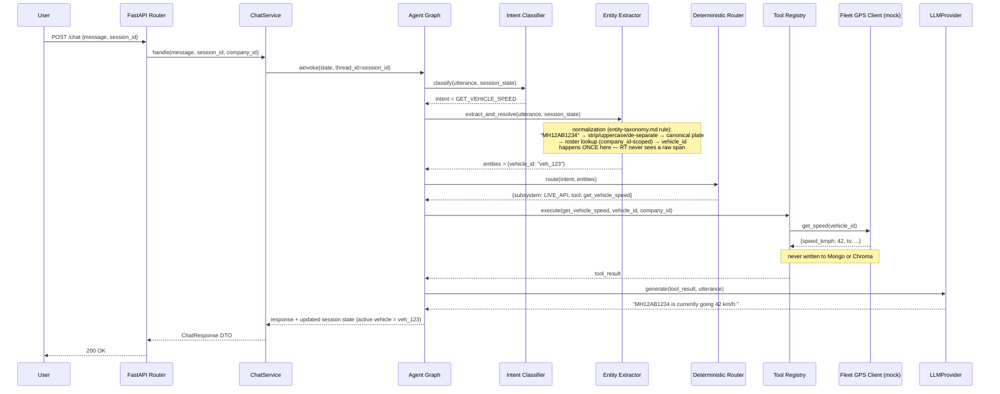
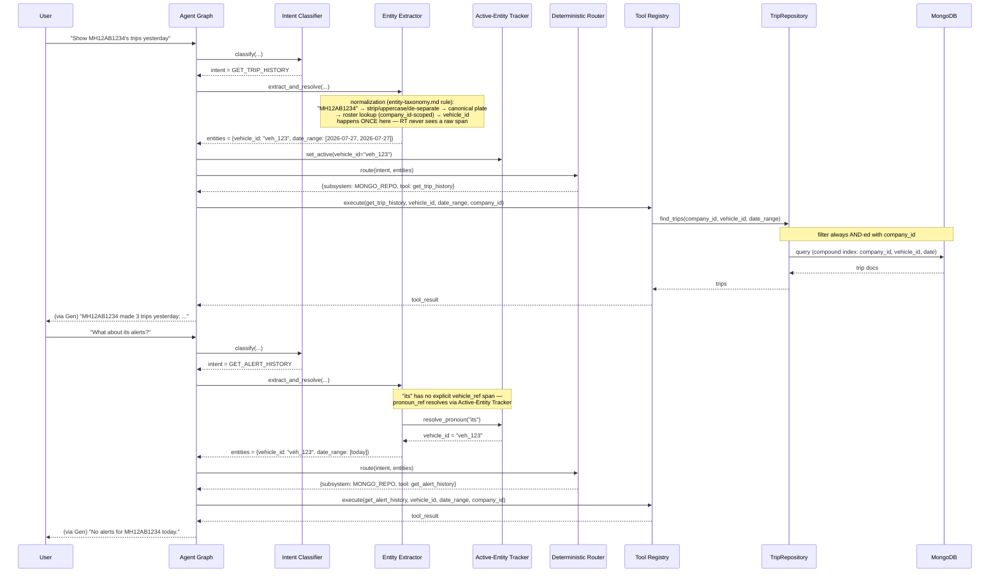
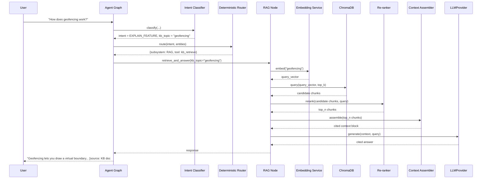
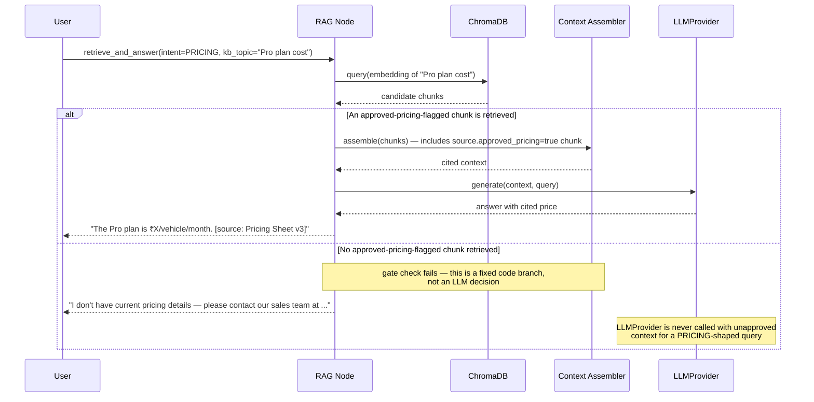

# Sequence Diagrams — Phase 2

Three representative flows, one per `target_subsystem` shape from the Phase 1 intent taxonomy.
A fourth diagram shows the `PRICING` gate branch in detail since it has non-obvious control flow.

**Locked-in rule:** vehicle registration normalization (the strip/uppercase/de-separate/
regex-validate pipeline defined in `entity-taxonomy.md`) happens exactly once per turn, inside
the Entity Extractor node, before the Deterministic Router node ever runs. The Router, Tool
Registry, repositories, and Fleet GPS client only ever see a canonical `vehicle_id` (or the
already-normalized plate used to resolve it) — never a raw user-typed span. Diagrams 1 and 2
both show this explicitly for that reason, rather than one showing it and the other skipping to
the resolved ID.

## 1. `LIVE_API` flow — `GET_VEHICLE_SPEED`

_"What's MH12AB1234's speed?"_

## 2. `MONGO_REPO` flow — `GET_TRIP_HISTORY`

_"Show MH12AB1234's trips yesterday"_ — then a follow-up _"what about its alerts?"_ to show
coreference resolution against session memory.

## 3. `RAG` flow — `EXPLAIN_FEATURE`

_"How does geofencing work?"_

## 4. `PRICING` gate branch (detail)

_"How much does the Pro plan cost?"_ — shown separately because the gate's alt path
(no approved doc → canned response) is easy to lose in a happy-path-only diagram.

