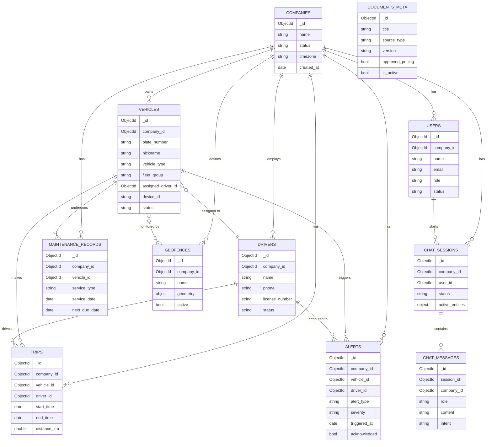

# MongoDB Schema & Indexes — Phase 3

## Scope

11 collections: `companies`, `users`, `vehicles`, `drivers`, `trips`, `alerts`,
`maintenance_records`, `geofences`, `chat_sessions`, `chat_messages`, `documents_meta`.
Implementation lives in `backend/app/db/`:

- `schema_definitions.py` — `$jsonSchema` validators + shared enums (single source of truth;
  Phase 6/9 import these rather than redefining the lists)
- `indexes.py` — index definitions, always leading tenant-scoped compound indexes with
  `company_id` per [ADR 004](../phase-2-architecture/adr/004-tenant-scoping-enforcement.md)
- `init_db.py` — idempotent create-or-update of collections/validators/indexes
- `seed_data.py` — synthetic seed data (see non-goals.md — nothing here is real)

No live telemetry (location/speed/fuel/live health) is stored anywhere in this schema, per the
roadmap's non-negotiable rule — that data only ever exists in-flight from the mocked Fleet GPS
API (Phase 9+), never persisted here.

## ER diagram



`DOCUMENTS_META` is intentionally disconnected from the tenant graph — it's a global KB source
registry (Phase 4/5), not per-company data; `approved_pricing` is the flag the `PRICING` intent
gate (see [sequence diagram #4](../phase-2-architecture/sequence-diagrams.md)) checks before
ever answering a pricing question.

## Design decisions worth flagging

- **`plate_number` is stored pre-normalized.** The schema's `pattern` validator enforces the
  canonical form from
  [entity-taxonomy.md's normalization rule](../phase-1-planning/entity-taxonomy.md) (strip →
  uppercase → remove separators → `^[A-Z]{2}\d{2}[A-Z]{1,2}\d{4}$`) — `"mh 12 ab 1234"` is
  rejected at the database level, not just by application code. Any future write path
  (Phase 6 entity resolution, Phase 9 tools, an eventual admin UI) must normalize *before*
  calling the repository, matching the "normalization happens once, in entity extraction"
  guarantee locked into the Phase 2 sequence diagrams.
- **Optional reference fields are omitted, never null.** `vehicles.assigned_driver_id`,
  `chat_messages.intent`, etc. are typed `bsonType: objectId`/`string` with no `null` allowed —
  an unassigned vehicle simply doesn't have the field, rather than having it set to `null`.
  Caught by the schema validator itself during seed-data development (see commit history):
  writing `null` into an optional field is now a hard validation failure, not a
  silently-accepted footgun for later phases to work around.
- **Trips are summarized, not raw breadcrumbs**, per non-goals.md — `start_location`/
  `end_location`/`distance_km`/`stop_count`, not a GPS ping stream.
- **`documents_meta.source_type` maps 1:1 to the Phase 1 KB intents**
  (`feature_guide`↔`EXPLAIN_FEATURE`, `app_faq`↔`APP_FAQ`, `troubleshooting`↔
  `TROUBLESHOOTING_DEVICE`, `policy`↔`POLICY_QUESTION`, `pricing`↔`PRICING`) —
  `GENERAL_KNOWLEDGE` has no corresponding source type since it's explicitly never backed by an
  ingested document.
- **`geofences.geometry` has a `2dsphere` index** even though geofence creation is a backlog
  intent (Phase 1, section C) — reading/listing geofences is in scope for v1, and the
  geospatial index costs nothing to define now versus retrofitting later.

## Index summary

| Collection | Indexes | Rationale |
|---|---|---|
| `companies` | `name` | Lookup by name (admin/support use) |
| `users` | `email` (unique) · `company_id` | Login lookup; tenant listing |
| `vehicles` | `(company_id, plate_number)` unique · `(company_id, device_id)` unique sparse · `(company_id, assigned_driver_id)` | Plate resolution is the hottest lookup (every `vehicle_ref` resolution goes through this); device_id used by the mocked Fleet GPS client to correlate |
| `drivers` | `company_id` · `(company_id, license_number)` unique sparse | Roster listing; license uniqueness where provided |
| `trips` | `(company_id, vehicle_id, start_time)` · `(company_id, driver_id, start_time)` | Both query shapes seen in the taxonomy (`GET_TRIP_HISTORY` by vehicle or by driver) |
| `alerts` | `(company_id, vehicle_id, triggered_at)` · `(company_id, alert_type, triggered_at)` · `(company_id, acknowledged)` | Vehicle history, type-filtered history, and the backlog `ACKNOWLEDGE_ALERT` triage view |
| `maintenance_records` | `(company_id, vehicle_id, service_date)` · `(company_id, next_due_date)` | History lookup; `GET_MAINTENANCE_DUE` needs a due-date scan across the fleet |
| `geofences` | `(company_id, active)` · `geometry` (2dsphere) | Active-geofence listing; future spatial queries |
| `chat_sessions` | `(company_id, user_id, last_active_at)` | Session lookup/listing per user |
| `chat_messages` | `(session_id, created_at)` · `(company_id, created_at)` | Conversation replay; company-wide audit/eval export |
| `documents_meta` | `source_type` · `approved_pricing` · `(title, version)` unique | KB browsing by category; fast `PRICING` gate check; version uniqueness |

Every tenant-scoped collection's compound indexes lead with `company_id`, verified by
`tests/test_indexes.py::test_tenant_scoped_collections_have_company_id_leading_index`.

## Testing

Run against a real MongoDB (schema validators and index creation are genuine server behavior
that in-memory fakes like `mongomock` don't faithfully reproduce):

```bash
cd backend
TEST_MONGO_URI="mongodb://127.0.0.1:27017" PYTHONPATH=. .venv/bin/python -m pytest tests/ -v
```

- `test_schema_validation.py` — every collection: a valid document inserts cleanly; a set of
  invalid documents (missing required field, bad enum, malformed plate pattern) are rejected by
  MongoDB's own validator.
- `test_indexes.py` — every declared index exists with the expected key pattern after
  `init_db()`; every tenant-scoped collection has at least one index led by `company_id`.

42/42 passing locally (11 collections × valid + invalid schema tests, plus 11 + 9 index tests).

## Seeding

```bash
cd backend
MONGO_URI="mongodb://127.0.0.1:27017" PYTHONPATH=. .venv/bin/python -m app.db.seed_data
```

Inserts one synthetic company ("Cosmica Test Fleets Pvt Ltd"), 2 users, 4 vehicles, 3 drivers,
2 trips, 2 alerts, 2 maintenance records, 1 geofence, 1 chat session with a 3-message transcript
mirroring the [Phase 2 coreference sequence diagram](../phase-2-architecture/sequence-diagrams.md),
and 6 `documents_meta` entries — including one `approved_pricing: true` pricing doc and one
`approved_pricing: false` draft, so the `PRICING` gate has both branches to exercise once
Phase 7 is built. Verified idempotent: running twice produces identical collection counts,
because record timestamps used in upsert filter keys are anchored to a fixed reference point
rather than wall-clock `now()` at script-run time.
